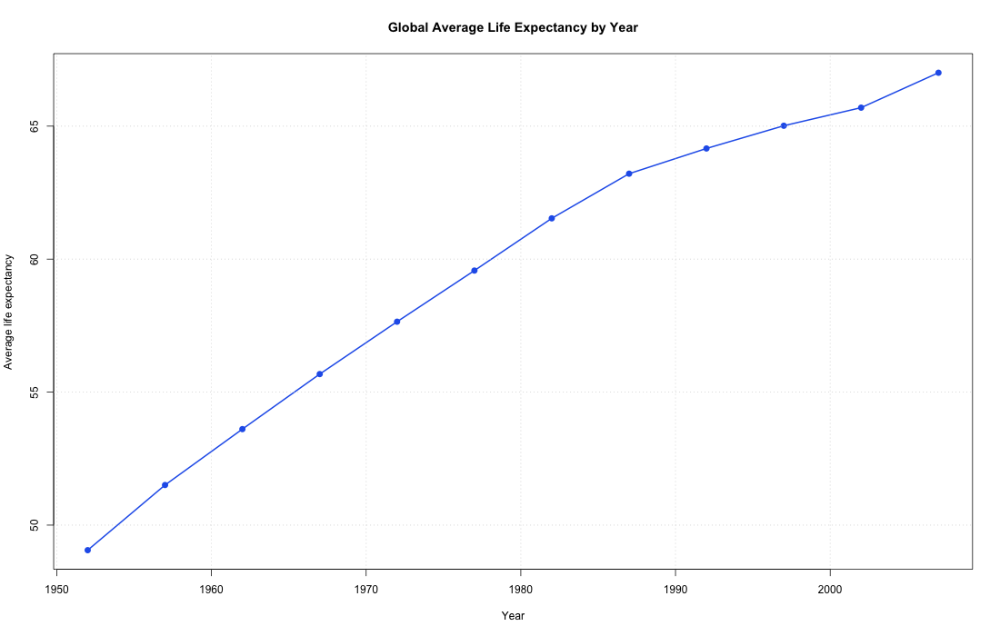
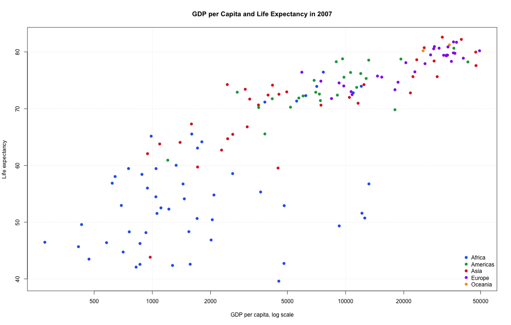
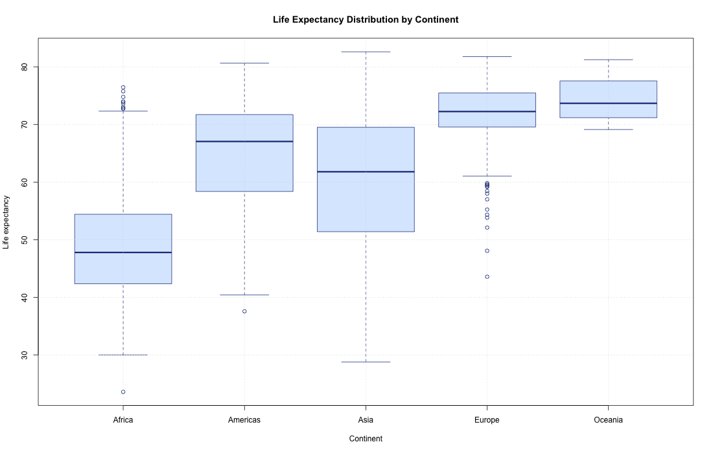
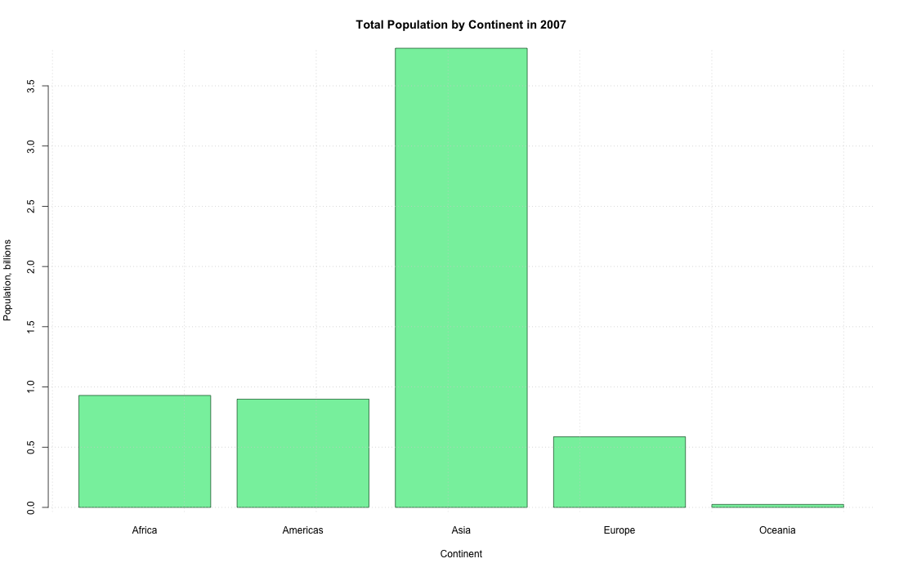

# Gapminder EDA Report

## Overview

- Rows: 1,704
- Countries: 142
- Continents: Africa, Americas, Asia, Europe, Oceania
- Year range: 1952 to 2007
- Missing values: 0

## Key Findings

- Average life expectancy increased by 17.95 years from 1952 to 2007.
- Average GDP per capita became 3.14 times larger over the same period.
- Total population became 2.60 times larger over the same period.
- The correlation between life expectancy and log10 GDP per capita is 0.81.
- In 2007, the highest average life expectancy appears in countries such as Japan, Hong Kong, China, Iceland.

## Numeric Summary

| variable | count | mean | sd | min | q25 | median | q75 | max |
|---|---|---|---|---|---|---|---|---|
| lifeexp | 1,704 | 59.47 | 12.92 | 23.60 | 48.20 | 60.71 | 70.84 | 82.60 |
| pop | 1,704 | 29,601,212.32 | 106,157,896.74 | 60,011.00 | 2,793,664.00 | 7,023,595.50 | 19,585,221.75 | 1,318,683,096.00 |
| gdppercap | 1,704 | 7,215.33 | 9,857.45 | 241.17 | 1,202.06 | 3,531.85 | 9,325.46 | 113,523.13 |

## Continent Summary

| continent | country_count | lifeexp | pop | gdppercap |
|---|---|---|---|---|
| Oceania | 2 | 74.33 | 8,874,672 | 18,621.61 |
| Europe | 30 | 71.90 | 17,169,765 | 14,469.48 |
| Americas | 25 | 64.66 | 24,504,795 | 7,136.11 |
| Asia | 33 | 60.06 | 77,038,722 | 7,902.15 |
| Africa | 52 | 48.87 | 9,916,003 | 2,193.75 |

## Top 10 Life Expectancy Countries in 2007

| country | continent | lifeexp | gdppercap | pop |
|---|---|---|---|---|
| Japan | Asia | 82.60 | 31,656.07 | 127,467,972 |
| Hong Kong, China | Asia | 82.21 | 39,724.98 | 6,980,412 |
| Iceland | Europe | 81.76 | 36,180.79 | 301,931 |
| Switzerland | Europe | 81.70 | 37,506.42 | 7,554,661 |
| Australia | Oceania | 81.24 | 34,435.37 | 20,434,176 |
| Spain | Europe | 80.94 | 28,821.06 | 40,448,191 |
| Sweden | Europe | 80.88 | 33,859.75 | 9,031,088 |
| Israel | Asia | 80.74 | 25,523.28 | 6,426,679 |
| France | Europe | 80.66 | 30,470.02 | 61,083,916 |
| Canada | Americas | 80.65 | 36,319.24 | 33,390,141 |

## Lowest 10 Life Expectancy Countries in 2007

| country | continent | lifeexp | gdppercap | pop |
|---|---|---|---|---|
| Swaziland | Africa | 39.61 | 4,513.48 | 1,133,066 |
| Mozambique | Africa | 42.08 | 823.69 | 19,951,656 |
| Zambia | Africa | 42.38 | 1,271.21 | 11,746,035 |
| Sierra Leone | Africa | 42.57 | 862.54 | 6,144,562 |
| Lesotho | Africa | 42.59 | 1,569.33 | 2,012,649 |
| Angola | Africa | 42.73 | 4,797.23 | 12,420,476 |
| Zimbabwe | Africa | 43.49 | 469.71 | 12,311,143 |
| Afghanistan | Asia | 43.83 | 974.58 | 31,889,923 |
| Central African Republic | Africa | 44.74 | 706.02 | 4,369,038 |
| Liberia | Africa | 45.68 | 414.51 | 3,193,942 |

## Generated Plots

### Average Life Expectancy Trend

### GDP per Capita and Life Expectancy

### Life Expectancy by Continent

### Population by Continent

